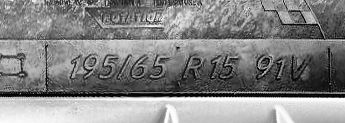

# Running Pipelines

As already mentioned on previous pages, running pipelines is about chaining several procedures from arbitrary available nodes, each procedure's output providing an input for the next procedure in line. For pipeline to start running, the schemes of the chained procedures must be compatible with each other. In other words, if output of procedure 1 is a string, it can't be followed by procedure which accepts a complex object.

## Listing available nodes and procedures

You can list all available nodes and their respective procedures using Orchestration Runner's /Nodes endpoint.

```json
{
  "items": [
    {
      "id": "tire-ocr-ocr",
      "procedures": [
        {
          "id": "PerformSingleOcr",
          "schemaVersion": 1,
          "input": {
            "type": "ApObject",
            "properties": {
              "detectorType": {
                "type": "ApEnum",
                "value": "",
                "supportedCases": [
                  "GoogleGemini",
                  "MistralPixtral",
                  "OpenAiGpt",
                  "GoogleCloudVision",
                  "AzureAiVision"
                ]
              },
              "image": {
                "type": "ApFile",
                "id": "00000000-0000-0000-0000-000000000000",
                "contentType": "",
                "supportedContentTypes": [
                  "image/jpeg",
                  "image/png",
                  "image/webp"
                ]
              }
            },
            "nonRequiredProperties": []
          },
          "output": {
            "type": "ApObject",
            "properties": {
              "detectedCode": {
                "type": "ApString",
                "value": ""
              },
              "estimatedCosts": {
                "type": "ApObject",
                "properties": {
                  "inputUnitCount": {
                    "type": "ApDecimal",
                    "value": 0
                  },
                  "outputUnitCount": {
                    "type": "ApDecimal",
                    "value": 0
                  },
                  "billingUnit": {
                    "type": "ApString",
                    "value": ""
                  },
                  "estimatedCost": {
                    "type": "ApDecimal",
                    "value": 0
                  },
                  "estimatedCostCurrency": {
                    "type": "ApString",
                    "value": ""
                  }
                },
                "nonRequiredProperties": []
              }
            },
            "nonRequiredProperties": ["estimatedCosts"]
          }
        }
      ]
    },
    {
      "id": "tire-ocr-postprocessing",
      "procedures": [
        {
          "id": "PerformTireCodePostprocessing",
          "schemaVersion": 1,
          "input": {
            "type": "ApString",
            "value": ""
          },
          "output": {
            "type": "ApObject",
            "properties": {
              "rawCode": {
                "type": "ApString",
                "value": ""
              },
              "postprocessedTireCode": {
                "type": "ApString",
                "value": ""
              },
              "vehicleClass": {
                "type": "ApString",
                "value": ""
              },
              "width": {
                "type": "ApDecimal",
                "value": 0
              },
              "aspectRatio": {
                "type": "ApDecimal",
                "value": 0
              },
              "construction": {
                "type": "ApString",
                "value": ""
              },
              "diameter": {
                "type": "ApDecimal",
                "value": 0
              },
              "loadIndex": {
                "type": "ApString",
                "value": ""
              },
              "speedRating": {
                "type": "ApString",
                "value": ""
              }
            },
            "nonRequiredProperties": [
              "vehicleClass",
              "width",
              "AspectRatio",
              "construction",
              "diameter",
              "loadIndex",
              "speedRating"
            ]
          }
        }
      ]
    }
  ]
}
```

In the above example output of the /Nodes endpoint, you can see two availabe nodes, one with id `tire-ocr-ocr` having one procedure `PerformSingleOcr`, which accepts an object with an enum and a file as an input and it outputs an object with a string 'detectedCode' and another nested object `estimatedCosts`. The other with id `tire-ocr-postprocessing` having one procedure `PerformTireCodePostprocessing`, which accepts a string on the input and outputs an object with several tire code parameters, most of them being optional.

## Running a standard pipeline

A standard pipeline in this context means running one single pipeline without awaiting the pipeline's result. As the run of the pipeline may take a long time, this is a preferred way to run single pipelines. Standard pipelines can be created and started via the /Pipelines endpoint in the Pipelines endpoint group. Following is an example on how to construct a pipeline using procedures of the two nodes mentioned in the previous section (`tire-ocr-ocr` and `tire-ocr-postprocessing`).

#### 1. Identifying JSON request components

If you take a look at the input format for the /Pipelines endpoint, you can see a JSON object with two properties:

```json
{
  "input": {},
  "steps": [
    {
      "nodeId": "string",
      "procedureId": "string",
      "outputValueSelector": "string"
    }
  ]
}
```

- `input`: a property where you put your ApScheme input corresponding with the input scheme of the first procedure of the pipeline.
- `steps`: an array of object identifying pipeline steps. Each object contains the `nodeId` of the node you will trigger, `procedureId` of that node that you want to use and an `outputValueSelector` (more on that later).

#### 2. Adding pipeline steps

We already know our two steps of the pipeline from the prevous block, they are:

1. `PerformSingleOcr` procedure of the `tire-ocr-ocr` node
2. `PerformTireCodePostprocessing` procedure of the `tire-ocr-postprocessing` node

For that, our `steps` property would look like this:

```json
{
  "input": {},
  "steps": [
    {
      "nodeId": "tire-ocr-ocr",
      "procedureId": "PerformSingleOcr"
    },
    {
      "nodeId": "tire-ocr-postprocessing",
      "procedureId": "PerformTireCodePostprocessing"
    }
  ]
}
```

However, you might have noticed that the input scheme of the `PerformTireCodePostprocessing` accepts only a simple string, but the output scheme of the `PerformSingleOcr` outputs an object with several properties. These schemes are therefore not compatible and Orchestration Runner won't allow running such pipeline. In our case, we are only interested in the `detectedCode` of the `PerformSingleOcr`'s output, which needs to be passed down to the next procedure. For this purpose, we can use the `outputValueSelector` property of the step to select that speciffic property of the output object.

##### OutputValueSelector

Output value selectors are simple strings, which you can use to narrow down output values of procedures for simpler scheme matching in pipelines. The strings are just dot (`.`) separated identifiers of either ApObject properties, or ApList indexes.

In the above example, for selecting the `detectedCode` property of the root object, we would use a selector like this: `"outputValueSelector": "detectorType"` if we wanted to pass `inputUnitCount` from the `estimatedCosts` to the next procedure, we would use output value selector like this: `"detectedCode.estimatedCosts.inputUnitCount"`. If `inputUnitCount` was an ApList and we would want to pass down it's first element, we would use selector like: `"detectedCode.estimatedCosts.inputUnitCount.0"`

With the addition of `outputValueSelector`, our steps property on the pipeline endpoint looks like this:

```json
{
  "input": {},
  "steps": [
    {
      "nodeId": "tire-ocr-ocr",
      "procedureId": "PerformSingleOcr",
      "outputValueSelector": "detectedCode"
    },
    {
      "nodeId": "tire-ocr-postprocessing",
      "procedureId": "PerformTireCodePostprocessing"
    }
  ]
}
```

#### 3. Adding pipeline input

The last remaining step is to add the initial input to the pipeline. This input must match the input scheme of the first procedure in the pipeline (`PerformSingleOcr` in our case).

Looking at the input scheme of the `PerformSingleOcr` procedure, we find that we must pass an Object with an enum property `detectorType` and a file property `image`.

```json
{
  "type": "ApObject",
  "properties": {
    "detectorType": {
      "type": "ApEnum",
      "value": "",
      "supportedCases": [
        "GoogleGemini",
        "MistralPixtral",
        "OpenAiGpt",
        "GoogleCloudVision",
        "AzureAiVision"
      ]
    },
    "image": {
      "type": "ApFile",
      "id": "00000000-0000-0000-0000-000000000000",
      "contentType": "",
      "supportedContentTypes": ["image/jpeg", "image/png", "image/webp"]
    }
  },
  "nonRequiredProperties": []
}
```

For the `detectorType` property, you may chose any of the `supportedCases` and put it in the `value` property of your input.

For the `image` property, you must first upload your desired image (having one of the supported content types) using the `/Files/Upload` endpoint. Then you can add the `image` property to your input and add the uploaded images's `id` and `contentType`.



_Above: image used in this example_

When you are done, you should be looking at an input similar to this:

```json
{
  "type": "ApObject",
  "properties": {
    "detectorType": {
      "type": "ApEnum",
      "value": "GoogleGemini"
    },
    "image": {
      "type": "ApFile",
      "id": "4e64f00b-31b0-4c4c-9978-57a8fe7002da",
      "contentType": "image/jpeg"
    }
  }
}
```

Together with the steps we constructed earlier, this gives us a complete input for the /Pipelines endpoint like this:

```json
{
  "input": {
    "type": "ApObject",
    "properties": {
      "detectorType": {
        "type": "ApEnum",
        "value": "GoogleGemini"
      },
      "image": {
        "type": "ApFile",
        "id": "16cf7a41-7ff8-492a-ab05-0ad0c724df75",
        "contentType": "image/jpeg"
      }
    }
  },
  "steps": [
    {
      "nodeId": "tire-ocr-ocr",
      "procedureId": "PerformSingleOcr",
      "outputValueSelector": "detectedCode"
    },
    {
      "nodeId": "tire-ocr-postprocessing",
      "procedureId": "PerformTireCodePostprocessing"
    }
  ]
}
```

When you post this request, you will get an immediate response with details of the pipeline including the `pipelineId` (which you will need to retrieve the pipeline results).

#### 4. Analyzing pipeline results

After previous step, you pipeline is already running. You may use the `pipelineId` from the response to check you pipeline progress and results using the `/PipelineResults/{pipelineId}` endpoint. You will know that the pipeline has finished running if the property `finishedAt` of the result is not `null` anymore. The result of our pipeline (after pipeline completion) should look like this:

```json
{
  "result": {
    "id": "0253fc50-7763-4140-8eda-613eca64e435",
    "userId": "608750a3-89c6-4d36-a043-fa99b340841d",
    "pipelineId": "84b76152-306c-4665-85af-c5dfdfa6e2c0",
    "initialInput": {
      "type": "ApObject",
      "properties": {
        "detectorType": {
          "type": "ApEnum",
          "value": "GoogleGemini",
          "supportedCases": null
        },
        "image": {
          "type": "ApFile",
          "id": "16cf7a41-7ff8-492a-ab05-0ad0c724df75",
          "contentType": "image/jpeg",
          "supportedContentTypes": null
        }
      },
      "nonRequiredProperties": []
    },
    "createdAt": "2025-08-24T16:08:02.546805Z",
    "updatedAt": "2025-08-24T16:08:08.332496Z",
    "finishedAt": "2025-08-24T16:08:08.241622Z",
    "stepResults": [
      {
        "order": 1,
        "id": "236fed7a-6095-4011-a36d-cd4054af3770",
        "nodeId": "tire-ocr-ocr",
        "nodeProcedureId": "PerformSingleOcr",
        "finishedAt": "2025-08-24T16:08:06.539024Z",
        "wasSuccessful": true,
        "outputValueSelector": "detectedCode",
        "result": {
          "type": "ApObject",
          "properties": {
            "detectedCode": {
              "type": "ApString",
              "value": "195/65 R15 91V"
            },
            "estimatedCosts": {
              "type": "ApObject",
              "properties": {
                "estimatedCost": {
                  "type": "ApDecimal",
                  "value": 0.0001248
                },
                "estimatedCostCurrency": {
                  "type": "ApString",
                  "value": "USD"
                },
                "inputUnitCount": {
                  "type": "ApDecimal",
                  "value": 1196
                },
                "outputUnitCount": {
                  "type": "ApDecimal",
                  "value": 13
                },
                "billingUnit": {
                  "type": "ApString",
                  "value": "Token"
                }
              },
              "nonRequiredProperties": []
            }
          },
          "nonRequiredProperties": []
        },
        "failureReason": null
      },
      {
        "order": 2,
        "id": "f4618701-63ba-48de-b740-8fca65842d9b",
        "nodeId": "tire-ocr-postprocessing",
        "nodeProcedureId": "PerformTireCodePostprocessing",
        "finishedAt": "2025-08-24T16:08:08.241622Z",
        "wasSuccessful": true,
        "outputValueSelector": null,
        "result": {
          "type": "ApObject",
          "properties": {
            "rawCode": {
              "type": "ApString",
              "value": "195/65 R15 91V"
            },
            "postprocessedTireCode": {
              "type": "ApString",
              "value": "195/65R1591V"
            },
            "width": {
              "type": "ApDecimal",
              "value": 195
            },
            "aspectRatio": {
              "type": "ApDecimal",
              "value": 65
            },
            "construction": {
              "type": "ApString",
              "value": "R"
            },
            "diameter": {
              "type": "ApDecimal",
              "value": 15
            },
            "loadIndex": {
              "type": "ApString",
              "value": "91"
            },
            "speedRating": {
              "type": "ApString",
              "value": "V"
            }
          },
          "nonRequiredProperties": [
            "width",
            "aspectRatio",
            "construction",
            "diameter",
            "loadIndex",
            "speedRating"
          ]
        },
        "failureReason": null
      }
    ]
  }
}
```

If an error is encountered at any step of the pipeline, the pipeline processing will stop and the failure info is included in the pipeline result. This will be the final step of that result, since no following steps are executed. Following is an example of equivalent pipeline result, but with `PerformTireCodePostprocessing` procedure failing.

```json
{
  "result": {
    "id": "b7bda8ff-e89a-467b-bc6c-318c513736d2",
    "userId": "608750a3-89c6-4d36-a043-fa99b340841d",
    "pipelineId": "0c8d0ea9-eede-4430-9af4-389bff8c1b13",
    "initialInput": {
      "type": "ApObject",
      "properties": {
        "detectorType": {
          "type": "ApEnum",
          "value": "GoogleGemini",
          "supportedCases": null
        },
        "image": {
          "type": "ApFile",
          "id": "16cf7a41-7ff8-492a-ab05-0ad0c724df75",
          "contentType": "image/jpeg",
          "supportedContentTypes": null
        }
      },
      "nonRequiredProperties": []
    },
    "createdAt": "2025-08-24T15:56:25.350329Z",
    "updatedAt": "2025-08-24T15:56:28.114996Z",
    "finishedAt": "2025-08-24T15:56:27.632135Z",
    "stepResults": [
      {
        "order": 1,
        "id": "8c4259c1-3f70-438d-835f-d9a674e0a54a",
        "nodeId": "tire-ocr-ocr",
        "nodeProcedureId": "PerformSingleOcr",
        "finishedAt": "2025-08-24T15:56:27.525172Z",
        "wasSuccessful": true,
        ...
      },
      {
        "order": 2,
        "id": "4f1fb76b-35f2-48a2-9d20-0eb87530f036",
        "nodeId": "tire-ocr-postprocessing",
        "nodeProcedureId": "PerformTireCodePostprocessing",
        "finishedAt": "2025-08-24T15:56:27.632135Z",
        "wasSuccessful": false,
        "outputValueSelector": null,
        "result": null,
        "failureReason": {
          "code": 500,
          "reason": "Failed to execute procedure PerformTireCodePostprocessing"
        }
      }
    ]
  }
}
```

## Running an awaited pipeline

An awaited pipeline in this context means running one single pipeline and awaiting the pipeline's result, which you will get as a direct response for creating the pipeline. This option is added mainly for simple pipelines that are expected to complete in reasonable times, which may be useful for some critical use-cases. Awaited pipelines can be created and started via the `/Pipelines/Awaited` endpoint in the Pipelines endpoint group. Input format for this endpoint and the logic behind constructing the pipeline is equivalent to the previously described Standard Pipeline with one addition.

For input of an awaited pipeline, you must include one additional mandatory property in the root object - `timeoutSeconds`. This is just a simple integer indicating a number of seconds of how long the OrchestrationRunner should wait for pipeline result before timing out and returning status code `408`.

If we wanted to run the previous pipeline as awaited, the input would look like this:

```json
{
  "input": {
    "type": "ApObject",
    "properties": {
      "detectorType": {
        "type": "ApEnum",
        "value": "GoogleGemini"
      },
      "image": {
        "type": "ApFile",
        "id": "16cf7a41-7ff8-492a-ab05-0ad0c724df75",
        "contentType": "image/jpeg"
      }
    }
  },
  "steps": [
    {
      "nodeId": "tire-ocr-ocr",
      "procedureId": "PerformSingleOcr",
      "outputValueSelector": "detectedCode"
    },
    {
      "nodeId": "tire-ocr-postprocessing",
      "procedureId": "PerformTireCodePostprocessing"
    }
  ],
  "timeoutSeconds": 120
```

Sending this request will trigger the pipeline and wait for it's completion. Once the pipeline has completed, server will return a response with the entire pipeline result (as was described in step 4. of the standard pipeline overview). If the pipeline took more than 120 seconds to complete, server would respond with a `408 - Timeout`. You can still check the pipeline's result later in thee `/PipelineResults/{pipelineId}` endpoint.

## Running pipeline batch

A Pipeline Batch in this context means running one single pipeline, but with multiple inputs in parallel. Pipeline batches are meant for processing large ammounts of data in parallel and can be run using the `/Pipelines/Batch` endpoint. As apposed to single-pipelines, batches can not be awaited.

The logic for constructing the pipeline stays the same. Namely the `steps` array is unchanged. There is however a small change in the `input` property, which in this case is transformed into `inputs` array. In this array you enter serveral ApElements of the same input scheme of the first procedure. Number these inputs then determines how many pipelines will be run in parallel.

Following the same example as before, we can run multiple `PerformSingleOcr`-`PerformTireCodePostprocessing` pipelines with differing images and detector types. The example below shows creating such pipeline.

```json
{
  "inputs": [
    {
      "type": "ApObject",
      "properties": {
        "detectorType": {
          "type": "ApEnum",
          "value": "GoogleGemini"
        },
        "image": {
          "type": "ApFile",
          "id": "16cf7a41-7ff8-492a-ab05-0ad0c724df75",
          "contentType": "image/jpeg"
        }
      }
    },
    {
      "type": "ApObject",
      "properties": {
        "detectorType": {
          "type": "ApEnum",
          "value": "MistralPixtral"
        },
        "image": {
          "type": "ApFile",
          "id": "63648f5b-fe9a-46df-90d3-d0b6ccf3345e",
          "contentType": "image/jpeg"
        }
      }
    }
  ],
  "steps": [
    {
      "nodeId": "tire-ocr-ocr",
      "procedureId": "PerformSingleOcr",
      "outputValueSelector": "detectedCode"
    },
    {
      "nodeId": "tire-ocr-postprocessing",
      "procedureId": "PerformTireCodePostprocessing"
    }
  ]
}
```

In the server response to this request, you will find that a batch record was created with a speciffic `pipelineBatchId`. All pipeline results stemming from this batch will be assigned to this id.

#### Analyzing pipeline batch results

Combined results of the pipeline batch can be accessed and analyzed under the `/PipelineResults/Batch/{pipelineBatchId}` endpoint. When you enter the batch id from the server response, you will get a list of all pipeline results under this batch. For the batch, you will get summary on how many pipelines finished successfully (`successfullyCompletedPipelineCount`) and how many pipelines finished with a failure (`failedPipelineCount`) With the pipeline batch created above, we get:

```json
{
  "batch": {
    "id": "b746c677-94a5-4566-8d80-e0f27dcda85b",
    "userId": "608750a3-89c6-4d36-a043-fa99b340841d",
    "finishedAt": "2025-08-24T16:38:22.423163Z",
    "totalPipelineCount": 2,
    "successfullyCompletedPipelineCount": 1,
    "failedPipelineCount": 1,
    "pipelineResults": [
      {
        "id": "bfd7cb66-b972-4f9c-80cc-c00cb016ab6b",
        "userId": "608750a3-89c6-4d36-a043-fa99b340841d",
        "pipelineId": "e30627ff-2498-4df0-9f7d-b03d4419f4aa",
        "initialInput": {
          "type": "ApObject",
          "properties": {
            "detectorType": {
              "type": "ApEnum",
              "value": "MistralPixtral",
              "supportedCases": null
            },
            "image": {
              "type": "ApFile",
              "id": "63648f5b-fe9a-46df-90d3-d0b6ccf3345e",
              "contentType": "image/jpeg",
              "supportedContentTypes": null
            }
          },
          "nonRequiredProperties": []
        },
        "createdAt": "2025-08-24T16:38:16.367005Z",
        "updatedAt": "2025-08-24T16:38:22.822887Z",
        "finishedAt": "2025-08-24T16:38:22.423163Z",
        "stepResults": [
          {
            "order": 1,
            "id": "895e6349-96b8-474f-8385-441285320e49",
            "nodeId": "tire-ocr-ocr",
            "nodeProcedureId": "PerformSingleOcr",
            "finishedAt": "2025-08-24T16:38:22.423163Z",
            "wasSuccessful": false,
            "outputValueSelector": "detectedCode",
            "result": null,
            "failureReason": {
              "code": 404,
              "reason": "No tire code detected"
            }
          }
        ]
      },
      {
        "id": "1b71acbb-f284-4e52-9c15-fcba413e9c2d",
        "userId": "608750a3-89c6-4d36-a043-fa99b340841d",
        "pipelineId": "3211c94b-fce9-40fd-a0bd-830e4cd92615",
        "initialInput": {
          "type": "ApObject",
          "properties": {
            "detectorType": {
              "type": "ApEnum",
              "value": "GoogleGemini",
              "supportedCases": null
            },
            "image": {
              "type": "ApFile",
              "id": "16cf7a41-7ff8-492a-ab05-0ad0c724df75",
              "contentType": "image/jpeg",
              "supportedContentTypes": null
            }
          },
          "nonRequiredProperties": []
        },
        "createdAt": "2025-08-24T16:38:16.366999Z",
        "updatedAt": "2025-08-24T16:38:19.57343Z",
        "finishedAt": "2025-08-24T16:38:18.892614Z",
        "stepResults": [
          {
            "order": 1,
            "id": "de569569-aec9-48b2-8629-cf26cf26cc84",
            "nodeId": "tire-ocr-ocr",
            "nodeProcedureId": "PerformSingleOcr",
            "finishedAt": "2025-08-24T16:38:18.823217Z",
            "wasSuccessful": true,
            "outputValueSelector": "detectedCode",
            "result": {
              "type": "ApObject",
              "properties": {
                "detectedCode": {
                  "type": "ApString",
                  "value": "195/65 R15 91V"
                },
                "estimatedCosts": {
                  "type": "ApObject",
                  "properties": {
                    "estimatedCost": {
                      "type": "ApDecimal",
                      "value": 0.0001248
                    },
                    "estimatedCostCurrency": {
                      "type": "ApString",
                      "value": "USD"
                    },
                    "inputUnitCount": {
                      "type": "ApDecimal",
                      "value": 1196
                    },
                    "outputUnitCount": {
                      "type": "ApDecimal",
                      "value": 13
                    },
                    "billingUnit": {
                      "type": "ApString",
                      "value": "Token"
                    }
                  },
                  "nonRequiredProperties": []
                }
              },
              "nonRequiredProperties": []
            },
            "failureReason": null
          },
          {
            "order": 2,
            "id": "d7216087-e246-471c-bce0-09a2da1ffd91",
            "nodeId": "tire-ocr-postprocessing",
            "nodeProcedureId": "PerformTireCodePostprocessing",
            "finishedAt": "2025-08-24T16:38:18.892614Z",
            "wasSuccessful": true,
            "outputValueSelector": null,
            "result": {
              "type": "ApObject",
              "properties": {
                "rawCode": {
                  "type": "ApString",
                  "value": "195/65 R15 91V"
                },
                "postprocessedTireCode": {
                  "type": "ApString",
                  "value": "195/65R1591V"
                },
                "width": {
                  "type": "ApDecimal",
                  "value": 195
                },
                "aspectRatio": {
                  "type": "ApDecimal",
                  "value": 65
                },
                "construction": {
                  "type": "ApString",
                  "value": "R"
                },
                "diameter": {
                  "type": "ApDecimal",
                  "value": 15
                },
                "loadIndex": {
                  "type": "ApString",
                  "value": "91"
                },
                "speedRating": {
                  "type": "ApString",
                  "value": "V"
                }
              },
              "nonRequiredProperties": [
                "width",
                "aspectRatio",
                "construction",
                "diameter",
                "loadIndex",
                "speedRating"
              ]
            },
            "failureReason": null
          }
        ]
      }
    ]
  }
}
```
